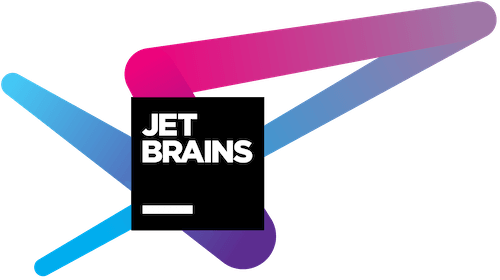

# Sponsors

[Canvas](https://trycanvas.app) is a freely available, open source project that gives something back to the greater
 [Laravel](https://laravel.com) community. Since blog platforms dominate so much of the Internet today, it makes
 sense that there should be a simple, easy-to-use package that can drop into your application with little to no effort.

**Financial contributions will never be required to maintain this project**, they are however very much appreciated
. If you've ever used Canvas in your daily work, either personally or professionally, and feel that it has made your
 life easier, consider [supporting the project](https://github.com/sponsors/austintoddj) for the price of a coffee.

If you haven't already, [star the repo](https://github.com/austintoddj/canvas/stargazers) to show your support, it makes a huge difference. Thank you in advance. :-)

---

## Open Source Sponsor (Licenses/Services)

<table width="100%" border="0" cellpadding="5">

<tr>
    <td align="center" valign="center">
        
    </td>
    <td align="center" valign="center">
        
    </td>
    <td align="center" valign="center">
        
    </td>
    <td align="center" valign="center">
        
    </td>
</tr>

<tr>
    <td align="center" valign="center">
        <a href="https://www.jetbrains.com">jetbrains.com</a>
    </td>
    <td align="center" valign="center">
        <a href="https://digitalocean.com/?refcode=41cb45b3c7db">digitalocean.com</a>
    </td>
    <td align="center" valign="center">
        <a href="https://www.navicat.com">navicat.com</a>
    </td>
    <td align="center" valign="center">
        <a href="https://readme.io">readme.io</a>
    </td>
</tr>

</table>
